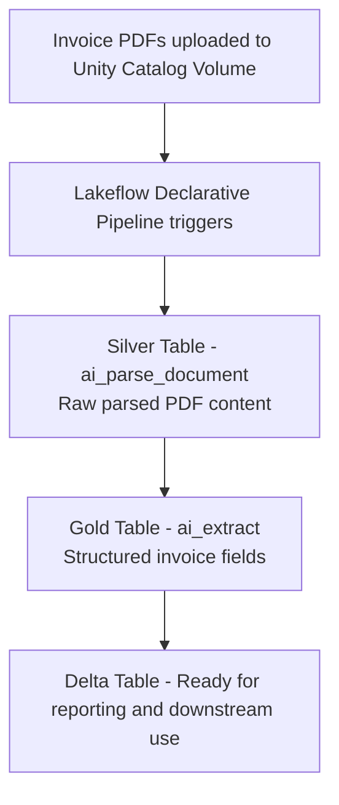

# Information_extraction_agent

# Automated Invoice Data Extraction using Databricks Mosaic AI Information Extraction Agent

## Overview

This project automates the extraction of structured data from invoice PDFs using the 
Databricks Mosaic AI Information Extraction Agent. Instead of manually reading invoices 
and entering data, this pipeline automatically picks up new PDFs, extracts the required 
fields, and stores them in a Delta table — with no manual steps needed.

---

## Problem Statement

Companies deal with hundreds of invoices every month. Extracting data from them manually 
is slow, error-prone, and does not scale. This project solves that by using Databricks AI 
functions to automate the entire process end to end.

---

## Tech Stack

- Databricks Mosaic AI Information Extraction Agent
- Databricks Lakeflow Declarative Pipeline (Delta Live Tables)
- Unity Catalog Volumes
- Delta Lake
- ai_parse_document()
- ai_extract()

---

## Architecture

## Architecture

## Limitations:

• This function is not available on Databricks SQL Classic.
• This function cannot be used with views.
• The schema supports a maximum of 128 fields.
• Field names can contain up to 150 characters.
• Schemas support up to 7 levels of nesting for nested fields.
• Enum fields support a maximum of 500 values.
• Type validation is enforced for integer, number, boolean, and enum types. If a value does not match the specified type, the function returns an error.
• The maximum total context size is 128,000 tokens.

